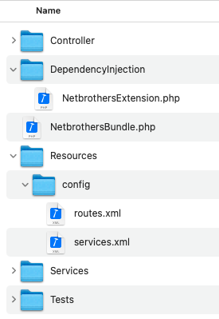

NetBrothers Create Symfony Bundle
===================================
This is a command line tool for creating skeleton structure for symfony bundle:
- creates directory structure and necessary files under `src/`
- activates your new bundle in symfony's `bundle.php`

The namespace of your bundle will be `App\[YourBundleName]`.




Installation
============
Make sure Composer is installed globally, as explained in the
[installation chapter](https://getcomposer.org/doc/00-intro.md)
of the Composer documentation.

Applications that use Symfony Flex
----------------------------------

Open a command console, enter your project directory and execute:

```console
composer require netbrothers-gmbh/nbcsb-bundle
```

Applications that don't use Symfony Flex
----------------------------------------

### Step 1: Download the Bundle

Open a command console, enter your project directory and execute the
following command to download the latest stable version of this bundle:

```console
composer require netbrothers-gmbh/nbcsb-bundle
```

### Step 2: Enable the Bundle

Then, enable the bundle by adding it to the list of registered bundles
in the `config/bundles.php` file of your project:

```php
// config/bundles.php

return [
    // ...
    NetBrothers\NbCsbBundle\NetBrothersNbCsbBundle::class => ['all' => true],
];
```


Usage
=====
Open a command console, enter your project directory and execute the
following command: 

```console
php bin/console netbrothers:make-bundle [YourBundleName]
```
Be aware to name your bundle with "Bundle" - like 
[symfony demand](https://symfony.com/doc/current/bundles/best_practices.html).

```console
# this is wrong !!!
php bin/console netbrothers:make-bundle Apple

# this is correct
php bin/console netbrothers:make-bundle AppleBundle
```

Configuration
=============
If you prefer to change templates:
- Find under `installation/templates` basic templates. Copy them to any place you like.
- Copy `installation/config/packages/netbrothers_createbundle.yaml` to symfony's config path
- Insert into `netbrothers_createbundle.yaml` your template path.
- Clear symfony's cache.

Author
======
[Stefan Wessel, NetBrothers GmbH](https://netbrothers.de)

Licence
=======
MIT


